# EV 充电站数据库设计

```mermaid
flowchart TB
    OP["<table style='width:900px;table-layout:fixed;border-collapse:collapse;font-size:12px'><colgroup><col style='width:14%'><col style='width:22%'><col style='width:10%'><col style='width:26%'><col style='width:28%'></colgroup><tr><th colspan='5'>OPERATOR<br/>运营商表</th></tr><tr><th>类型</th><th>属性</th><th>PK/FK</th><th>含义</th><th>原始字段 / 变化</th></tr><tr><td>INTEGER</td><td>operator_id</td><td>PK</td><td>运营商本地唯一编号</td><td>新增，由数据库生成</td></tr><tr><td>VARCHAR</td><td>operator_name</td><td></td><td>清洗后的运营商名称</td><td>来自 Operator，拆分并统一命名</td></tr><tr><td>VARCHAR</td><td>operator_name_normalised</td><td></td><td>匹配用标准名称</td><td>新增，统一大小写、空格和别名</td></tr></table>"]
    SA["<table style='width:900px;table-layout:fixed;border-collapse:collapse;font-size:12px'><colgroup><col style='width:14%'><col style='width:22%'><col style='width:10%'><col style='width:26%'><col style='width:28%'></colgroup><tr><th colspan='5'>SA4_REGION<br/>SA4 区域表</th></tr><tr><th>类型</th><th>属性</th><th>PK/FK</th><th>含义</th><th>原始字段 / 变化</th></tr><tr><td>VARCHAR</td><td>sa4_code</td><td>PK</td><td>SA4 唯一代码</td><td>来自 SA4_CODE26</td></tr><tr><td>VARCHAR</td><td>sa4_name</td><td></td><td>SA4 区域名称</td><td>来自 SA4_NAME26</td></tr><tr><td>VARCHAR</td><td>gcc_code / gcc_name</td><td></td><td>GCCSA 代码和名称</td><td>来自 GCC_CODE26 / GCC_NAME26</td></tr><tr><td>VARCHAR</td><td>state_code / state_name</td><td></td><td>州或领地代码和名称</td><td>来自 STE_CODE26 / STE_NAME26</td></tr><tr><td>DOUBLE</td><td>area_sq_km</td><td></td><td>区域面积（平方公里）</td><td>来自 AREASQKM26</td></tr><tr><td>GEOMETRY</td><td>geometry</td><td></td><td>SA4 多边形边界</td><td>来自 Shapefile 几何</td></tr></table>"]
    CL["<table style='width:900px;table-layout:fixed;border-collapse:collapse;font-size:12px'><colgroup><col style='width:14%'><col style='width:22%'><col style='width:10%'><col style='width:26%'><col style='width:28%'></colgroup><tr><th colspan='5'>CHARGER_LOCATION<br/>充电站位置表</th></tr><tr><th>类型</th><th>属性</th><th>PK/FK</th><th>含义</th><th>原始字段 / 变化</th></tr><tr><td>BIGINT</td><td>charger_id</td><td>PK</td><td>本地充电站编号</td><td>新增，由数据库生成</td></tr><tr><td>VARCHAR</td><td>source_objectid</td><td></td><td>来源对象编号</td><td>来自 OBJECTID，改名</td></tr><tr><td>VARCHAR</td><td>station_name</td><td></td><td>充电站名称</td><td>来自 Station_name，改名</td></tr><tr><td>VARCHAR</td><td>station_address</td><td></td><td>充电站地址</td><td>来自 Station_address，改名</td></tr><tr><td>INTEGER</td><td>operator_id</td><td>FK</td><td>运营商编号</td><td>新增，连接 operator.operator_id</td></tr><tr><td>DOUBLE</td><td>latitude / longitude</td><td></td><td>纬度和经度</td><td>来自 Latitude / Longitude，转为 DOUBLE</td></tr><tr><td>VARCHAR</td><td>postcode</td><td></td><td>邮政编码</td><td>来自 PCODE，改名</td></tr><tr><td>VARCHAR</td><td>lga_name</td><td></td><td>地方政府区域</td><td>来自 LGANAME，改名</td></tr><tr><td>VARCHAR</td><td>source_category</td><td></td><td>数据来源类别</td><td>来自 Source，改名</td></tr><tr><td>GEOMETRY</td><td>geom</td><td></td><td>充电站空间点</td><td>新增，由经纬度生成</td></tr><tr><td>VARCHAR</td><td>sa4_code</td><td>FK</td><td>所属 SA4 代码</td><td>新增，通过空间连接得到</td></tr></table>"]
    CC["<table style='width:900px;table-layout:fixed;border-collapse:collapse;font-size:12px'><colgroup><col style='width:14%'><col style='width:22%'><col style='width:10%'><col style='width:26%'><col style='width:28%'></colgroup><tr><th colspan='5'>CHARGER_CHARACTERISTIC<br/>充电器属性表</th></tr><tr><th>类型</th><th>属性</th><th>PK/FK</th><th>含义</th><th>原始字段 / 变化</th></tr><tr><td>BIGINT</td><td>charger_id</td><td>PK, FK</td><td>对应充电站编号</td><td>来自本地 charger_id</td></tr><tr><td>VARCHAR</td><td>charger_type</td><td></td><td>AC、DC 或 Upcoming</td><td>来自 Charger_Type，改名</td></tr><tr><td>INTEGER</td><td>number_of_plugs</td><td></td><td>插头数量</td><td>来自 Number_of_plugs，转为 INTEGER</td></tr><tr><td>VARCHAR</td><td>rating_raw</td><td></td><td>原始功率文本</td><td>来自 Charger_rating，保留原文</td></tr><tr><td>DOUBLE</td><td>rating_kw</td><td></td><td>数值功率（kW）</td><td>新增，由 rating_raw 解析</td></tr></table>"]
    AR["<table style='width:900px;table-layout:fixed;border-collapse:collapse;font-size:12px'><colgroup><col style='width:14%'><col style='width:22%'><col style='width:10%'><col style='width:26%'><col style='width:28%'></colgroup><tr><th colspan='5'>AUGMENTATION_RECORD<br/>外部增强信息表</th></tr><tr><th>类型</th><th>属性</th><th>PK/FK</th><th>含义</th><th>原始字段 / 变化</th></tr><tr><td>BIGINT</td><td>augmentation_id</td><td>PK</td><td>增强记录编号</td><td>新增，由数据库生成</td></tr><tr><td>BIGINT</td><td>charger_id</td><td>FK</td><td>对应充电站编号</td><td>新增，连接 charger_location.charger_id</td></tr><tr><td>VARCHAR</td><td>external_source</td><td></td><td>外部数据来源</td><td>新增</td></tr><tr><td>VARCHAR</td><td>external_id</td><td></td><td>外部平台编号</td><td>来自外部数据源</td></tr><tr><td>VARCHAR</td><td>plug_type</td><td></td><td>插头类型</td><td>外部数据新增属性</td></tr><tr><td>VARCHAR / DOUBLE</td><td>price_text / price_amount</td><td></td><td>原始价格和数值价格</td><td>外部数据 / 解析新增</td></tr><tr><td>INTEGER</td><td>number_of_bays</td><td></td><td>充电位数量</td><td>外部数据新增属性</td></tr><tr><td>TIMESTAMP</td><td>retrieved_at</td><td></td><td>获取时间</td><td>新增，用于记录时效</td></tr><tr><td>VARCHAR</td><td>match_method</td><td></td><td>匹配方法</td><td>新增，记录坐标、名称或地址匹配</td></tr><tr><td>DOUBLE</td><td>match_confidence</td><td></td><td>匹配可信度</td><td>新增，通常为 0 到 1</td></tr><tr><td>VARCHAR</td><td>raw_payload</td><td></td><td>原始 API 响应</td><td>新增，用于追溯</td></tr></table>"]

    OP -->|运营商负责| CL
    SA -->|包含充电站| CL
    CL -->|具有属性| CC
    CL -->|获得增强信息| AR

    classDef entity fill:#f8fbff,stroke:#4b83b4,stroke-width:1px,color:#222
    class OP,SA,CL,CC,AR entity
```



## 各表职责

| 数据表 | 作用 |
|---|---|
| `operator` | 每个清洗后的运营商保存一条记录。 |
| `sa4_region` | 每个 SA4 区域保存一条记录，并保存边界几何。 |
| `charger_location` | 保存充电站位置、来源编号、坐标和空间连接结果。 |
| `charger_characteristic` | 保存充电类型、插头数量和功率字段。 |
| `augmentation_record` | 保存外部来源提供的额外属性和匹配证据，一个充电站可以有多条记录。 |

## 设计决定

- `charger_id` 在本地生成，因为原始数据中的 `OBJECTID` 有很多缺失。
- `operator_id` 可以避免在每条充电站记录中重复保存运营商文本。
- `sa4_code` 用来连接充电站所在的 SA4 多边形。
- `rating_raw` 保留原始功率文本；如果可以解析，则用 `rating_kw` 支持数值分析。
- `geometry` 在每个 SA4 区域中只保存一次；`geom` 保存充电站点。
- 增强数据单独保存，因为外部匹配可能缺失、重复，或需要定期重新获取。
- 最终创建或查询空间字段前，需要在 DuckDB 中加载 Spatial 扩展。

## 空间关系

如果一个充电站点位于某个 SA4 多边形内部，就把该 SA4 分配给这个充电站：

```text
充电站点 `charger_location.geom` -> 空间包含查询 -> SA4 代码 `sa4_region.sa4_code`
```
