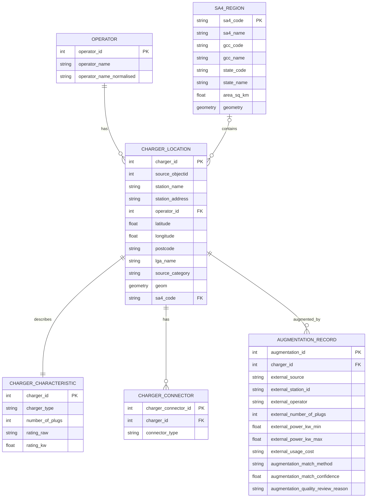

# EV Charging Station Database Design

## 1. ER Diagram



## 2. Table Responsibilities and Keys

| Table | PK | FK | Purpose | Real input |
|---|---|---|---|---|
| `operator` | `operator_id` | None | Stores cleaned base operators | `Operator` in `aug_data/nsw_ev_charging.csv` |
| `sa4_region` | `sa4_code` | None | Stores SA4 metadata and polygon geometry | ABS SA4 Shapefile |
| `charger_location` | `charger_id` | `operator_id`, `sa4_code` | Stores each charger's location and spatial information | `aug_data/nsw_ev_charging.csv` |
| `charger_characteristic` | `charger_id` | `charger_id`, therefore **PK + FK** | Stores the base charger type, plug count and rating | `aug_data/nsw_ev_charging.csv` |
| `charger_connector` | `charger_connector_id` | `charger_id` | Stores one normalized connector type per charger per row | `external_connector_types_normalized` (input only) |
| `augmentation_record` | `augmentation_id` | `charger_id` | Stores accepted external attributes, provenance and matching evidence | `aug_data/nsw_ev_charging.csv`; audit used for validation |

In the relational design, `charger_characteristic.charger_id` is both a primary key and a foreign key. It references `charger_location.charger_id` and expresses that each charger has exactly one characteristic row. The Mermaid diagram displays only `PK` for rendering stability; the actual **PK + FK** relationship is defined in this table.

## 3. Field Sources and Provenance

| Final field | Real source | Description |
|---|---|---|
| `operator_name` | `Operator` in `aug_data` | Non-empty for 1,958/1,958 rows; base operator |
| `station_name`, `station_address` | `Station_name`, `Station_address` in `aug_data` | Task 2 cleaned base fields |
| `latitude`, `longitude` | `Latitude`, `Longitude` in `aug_data` | Original charger coordinates in WGS84 |
| `postcode`, `lga_name`, `source_category` | `PCODE`, `LGANAME`, `Source` in `aug_data` | Base location attributes |
| `charger_type`, `number_of_plugs`, `rating_raw` | `Charger_Type`, `Number_of_plugs`, `Charger_rating` in `aug_data` | Characteristic attributes; `Charger_rating` may be NULL |
| `external_source` | `external_source` in `aug_data` | Non-empty for 239 accepted rows |
| `external_station_id` | `external_station_id` in `aug_data` | External station ID from OCM, OSM or Charge@Large |
| `external_operator` | `external_operator` in `aug_data` | Non-empty for 217 accepted rows; retained as a source-specific external attribute |
| `external_number_of_plugs` | `external_number_of_plugs` in `aug_data` | Reliable scalar value for 190 accepted rows |
| `external_power_kw_min` | `external_power_kw_min` in `aug_data` | Non-empty for 135 accepted rows |
| `external_power_kw_max` | `external_power_kw_max` in `aug_data` | Reliable scalar value for 162 accepted rows |
| `external_usage_cost` | `external_usage_cost` in `aug_data` | Non-empty for 113 accepted rows; an actual pricing-related field |
| `augmentation_match_method` | `augmentation_match_method` in `aug_data` | Non-empty for 239 accepted rows |
| `augmentation_match_confidence` | `augmentation_match_confidence` in `aug_data` | A rule score, not a calibrated probability |
| `augmentation_quality_review_reason` | `augmentation_quality_review_reason` in `aug_data` | Non-empty for 69 accepted rows; stores accepted-enrichment quality warnings |

### Derived fields and local surrogate IDs

- `rating_kw` is a derived numeric field parsed from the source `Charger_rating`, represented in the schema as the parsed form of `rating_raw`.
- `operator_name_normalised` is derived from the Task 2 operator cleaning and normalisation process; it is not an upstream source column.
- `operator_id`, `charger_id`, `charger_connector_id` and `augmentation_id` are local surrogate IDs generated during the Task 4 load stage. They are not upstream source columns.
- The exact ID generation method is intentionally not fixed here. The later implementation must first follow the lecturer examples before introducing any additional ID mechanism.

## 4. Cardinality and SA4 assignment validation

The final `aug_data/nsw_ev_charging.csv` contains 1,958 charger rows:

| Check | Result |
|---|---:|
| Rows checked | 1,958 |
| Rows with `SA4_CODE26` | 1,957 |
| Rows without `SA4_CODE26` | 1 |
| SA4 assignment coverage | 99.95% |

The one unmatched row has coordinates `Latitude=-33.80467` and `Longitude=151.2528397`, but no `SA4_CODE26` in the final augmented output. Therefore `charger_location.sa4_code` is nullable and the design must allow a charger without a successful SA4 assignment:

```text
SA4_REGION 1 ---- N CHARGER_LOCATION
CHARGER_LOCATION.sa4_code: nullable FK
```

The ER relationship remains structurally unchanged, but the nullable foreign key is an explicit data condition. The schema must not claim that all 1,958 chargers have a matched SA4.

## 5. CRS and spatial loader requirement

The confirmed CRS path is:

- `aug_data` charger `Latitude` / `Longitude`: EPSG:4326.
- ABS SA4 polygon Shapefile: GDA2020 / EPSG:7844, confirmed from the `.prj` file.
- Task 2 creates charger points in EPSG:4326 and calls `to_crs(sa4_gdf.crs)` before spatial join.

The later spatial loader must follow this alignment principle. It must not apply a spatial predicate directly between an EPSG:4326 `ST_Point` and an EPSG:7844 polygon. The point geometry used with `ST_Contains` or `ST_Intersects` must first be transformed or otherwise aligned to the SA4 polygon CRS. The original latitude and longitude fields remain available as source coordinates.

## 6. Task 2/3 to Task 4 data flow

```text
Task 2 cleaned data
    |
    v
Task 3 augmented main dataset
    |
    v
Task 4 charger tables

Task 3 audit -> matching, provenance and validation only
ABS SA4    -> sa4_region and spatial assignment
```

### PRIMARY INPUT

Task 4 charger tables use only:

```text
aug_data/nsw_ev_charging.csv
```

The cleaned file is an upstream lineage input, not a second charger input. The Task 3 audit CSV and summary are supplementary validation/provenance inputs. The ABS Shapefile is the supplementary spatial-region input.

## 7. Normalisation and uniqueness

`external_connector_types_normalized` is an input column used to create `charger_connector`; it is not stored as a final normalized database column. Each connector type is stored in its own child/detail row, satisfying 1NF for the connector relationship.

The schema remains at least 2NF because each table uses a single primary key and non-key attributes depend on the whole key. The later DDL should add:

```text
UNIQUE(charger_id, connector_type)
```

No UNIQUE constraint should be imposed on `source_objectid` or `(external_source, external_station_id)` because the real upstream data contains missing/repeated source IDs and repeated external-ID assignments.


